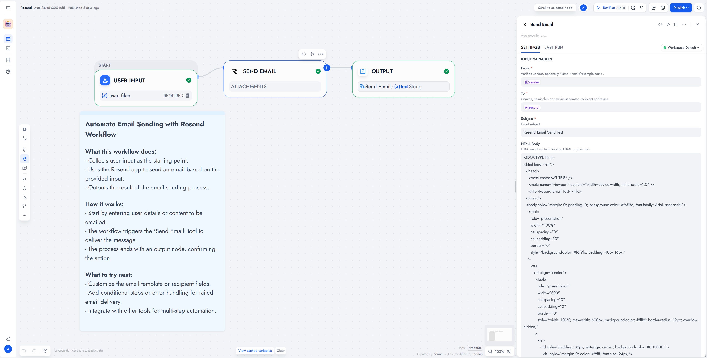

# Resend

Send HTML or plain-text email with Dify file attachments using your Resend API key. No OAuth.

**Source:** [https://github.com/erbanku/resend](https://github.com/erbanku/resend)

**Contact:** [GitHub issues](https://github.com/erbanku/resend/issues)

## Overview

Add **Send Email** to a workflow, set a verified sender, and bind recipients, subject, and body. Attachments come from a Dify file-list variable. `status: accepted` means Resend accepted the request, not that the inbox received it.

## Setup

1. Install **Resend** from the Dify Plugin Marketplace (or from this repository's package).
2. Authorize the provider with a Resend **API key** (`re_...`). Sending-access and full-access keys both work.
3. Verify the sender domain in [Resend](https://resend.com/domains).
4. Add **Resend → Send Email** to a Chatflow, Workflow, or Agent.
5. Fill **From**, **To**, **Subject**, and **HTML Body** or **Plain Text Body**.

### Use the tool

- **Chatflow / Workflow:** bind a file-list variable to **Attachments** when needed. Do not paste local paths or arbitrary URLs there.
- **Agent:** add Send Email and give it a verified sender plus recipients.

## Screenshots

## Inputs

|            Field            |   Required   |                         Notes                          |
| :-------------------------: | :----------: | :----------------------------------------------------: |
|            From             |     Yes      |     `Name <you@your-domain>` on a verified domain      |
|             To              |     Yes      | Addresses separated by commas, semicolons, or newlines |
|           Subject           |     Yes      |                     No line breaks                     |
| HTML Body / Plain Text Body | One required |               Both allowed for multipart               |
|         Attachments         |      No      |                Dify file-list variable                 |
|     CC / BCC / Reply To     |      No      |             Same address separators as To              |
|       Idempotency Key       |      No      |              Stable key per logical email              |

Usage details

Credential setup checks key format locally and does not send a test message. A revoked but well-formed key saves and fails on first send.

Use an idempotency key if the workflow might retry. Resend keeps keys for 24 hours. Reuse the same key only with the same payload. No automatic retries. After a timeout, check Resend logs before sending again.

Success JSON: `id`, `status: accepted`, `attachment_count`. Errors omit raw bodies, API keys, message content, file URLs, and BCC.

This plugin only sends email. It does not track delivery, receive mail, or send batches.

Limits and security

- Combined To/CC/BCC: 50 recipients.
- Raw attachments: 28 MB. Encoded JSON: 39 MB. Resend may apply tighter limits.
- Network access: the plugin host must reach `api.resend.com` and Dify file URLs.
- Prefer a sending-only, domain-restricted key.

See [PRIVACY.md](./PRIVACY.md).

References

- [Send email API](https://resend.com/docs/api-reference/emails/send-email)
- [API keys](https://resend.com/docs/api-reference/api-keys/create-api-key)
- [Idempotency](https://resend.com/docs/dashboard/emails/idempotency-keys)

Independent integration. Resend name and marks belong to their owners.

